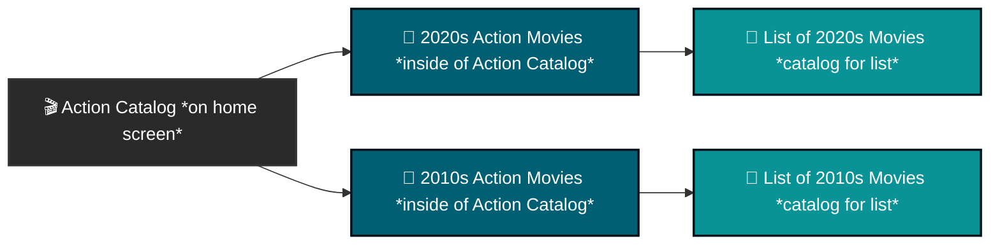

## Nuvio Collections

>[!CAUTION]
>Creating collections should be considered an advanced user feature (seriously this is a warning). If you do not consider yourself an advanced user it is recommend to copy one from [nuvio's community collections](https://nuvio.tv/community-collections)

### Nuvio Collection Structures

Nuvio collections can be confusing. At its core though, it is a file system with folders and subfolders and files in those subfolders (catalogs). Below is a diagram to illustrate this.

### Simplified Catalog Structure

**To Create a collection**

There are a few key things you will need to create a collection.
1. A metadata addon with youur catalogs that you want to be in a collection already created. This guide will be assuming you have done this.
2. Images or gifs for your collections. These can be sourced from the internet or from [nuvios community covers](https://nuvio.tv/covers)
    - Note that if you do not use nuvio's community covers the image or source gif must be the actual location that the image is located in.
        - For example, https://github.com/rrevanth/nuvio-assets/blob/main/popular/new/new-poster.png **will not work**
        - https://raw.githubusercontent.com/rrevanth/nuvio-assets/refs/heads/main/popular/new/new-poster.png **will work**
    - You can optionally, upload your own images or gifs you'd like to use to nuvio's community collections.

Great, now that we have that figured out, lets create our first collection. You can do this in the app or on the nuvio website but using the websit is recommened.
1. Once logged into your account, make sure you are on the account tab.
2. On the left sidebar, select collections
3. Select create collection
4. You will be prompted to select a template to start, we will skip that in this guide so select contineu
5. There will be multiple options on this tab
    - Collection ID: leave this as is
    - Title: Put what you want the name that will show on the collection
    - View Mode: There will be 3 options: tabbed grid, rows, or follow layout
        - Tabbed grid will appeear as, well a grid with tabs inside of the collection. Each subfolder will have its own tab with this option. If you want to Make an Action catalog with with Action movies 2020 and Action movies 2010 within this catalog, both of those will have their own tab inside of this catalog. These tabs will be in a grid layout
        - Rows will show rows inside of the collection. If you want to Make an Action catalog with with Action movies 2020 and Action movies 2010 within this catalog, both of those will be under the same tab but on their own rows.
        - Follow layout will follow the layout of what you have set in the nuvio app
    - Backdrop Image or GIF URL: This is where you will paste the url that we previously mentioned how to get
    - Show all Tab: With this selected an extra tab will be added to this collection that will combine all of subfolders you add under this collection
    - Pin to top: This will move the collection to the front ahead of others
    - Enable focus glow: Will add a highlight effect when you hover over the collection
6. Now at the folders tab you will have many options in here:
    - Outline on the left side
        - This is where you will add what you want to show on your homescreen for this collection. For instance, if you are createing a Collection called "franchises", and what to have seperate blocks on your home screen for the Matrix, Lord of the Rings, Star Wars, you will had a folder here for each one.
    - Folder ID: Keep this as is
    - Folder Title: This is what the name of the tab or row will be INSIDE of the collection. E.g. The Collection will be named Action, and the tabs will be named Action Movies 2020 and Action Movies 20109
    - TileShape: Choose what you prefer the shape to be between landsance, square, or portrai
    - Sources:
       - You will have an option to add catalog, add TMDB, and Add Trakt
            - Selecting add catalog you will be asked to choose the source of the addon. This will comee from you metadata addon e.g. aiometadata
                - You will also be asked for the catalog. You will pick the catalog that you made using an addon like aiometadata
            - Selecting add TMDB will provide you many options. They fall into these buckets:
                - General Settings (Common Across All Sources)
                    - These settings define the basic presentation and ordering of your collection within Nuvio.
                    - Type: Determines the media format for the list. You can select either Movie or Series.
                    - Name: The custom title for your collection. This is exactly how the list will be labeled on your Nuvio interface (e.g., "Top Sci-Fi" or "My Watchlist").
                    - Sort By: Controls the display sequence of the media. Common options include:
                        - Original: Keeps the exact order set by the database or list creator.
                        - Recent: Sorts by release date.
                        - Top Rated: Ranks items by their user review scores or the total number of ratings.
                - ID-Based Sources
                    - Most sources require a specific identifier to pull the correct metadata from the respective database.
                    - Sources: TMDB List, Trakt List, TMDB Keyword, TMDB Company, TMDB Collection.
                    - ID Field: This requires a specific numerical or alphanumeric code. You must locate the exact list, collection, company, or keyword on TMDB or Trakt and extract the ID from its URL. For example, in the TMDB URL themoviedb.org/collection/1248, the ID is 1248.
                - Unique Sources
                    - Certain sources use different input fields instead of a standard ID to gather content.
                    - TMDB Discover:
                        - Genres Field: Instead of an ID, you select one or more genres from a dropdown menu (such as Action, Horror, or Science Fiction). This dynamically generates a collection of media that fits those specific categories directly from TMDB's database.
                    - Letterboxd List:
                        - URL Field: This requires the full web address of the Letterboxd list you wish to import. You must paste the exact link from your browser rather than looking for a specific ID code.
